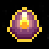
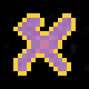
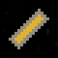
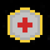
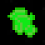
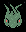
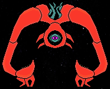

# Space Shooter

# Project Introduction

This game was made with the [Amethyst](https://amethyst.rs/) engine. It is inspired by games like Raiden and The Binding of Isaac. Checkout my development journey on my [youtube](https://www.youtube.com/watch?v=OtN5vL80u4Q&list=PL4Dmmk1VXA5p0tVmxNUr8j0ly5ERbL1hN) channel and my write-up about using Amethyst on my [website](https://micronote.tech/2019/06/Space-Shooter-Game/).

# Game Introduction

In this game you control a spaceship. Your goal is to defend an objective from the incoming invasion of enemy spaceships while not letting your health deplete in the process. You can shoot the enemies with your spaceships blasters or ram into them with your barrel roll dealing damage to yourself in the process. How long can you last?

# To Run

To run on MacOSX make sure that XCode is installed and change the line in the Cargo.toml file:

`features = ["vulkan"]` => `features = ["metal"]`

Leave everything as is if running on Windows or Linux and enter `cargo run` in the root of the project.

# Controls

|Key|Action|
|:---:|:---:|
|W|Accelerate up.|
|S|Accelerate down.|
|A|Accelerate left.|
|D|Accelerate right.|
|Space|Fire blast.|
|Left|Barrel roll left.|
|Right|Barrel roll right.|
|Escape|Pause the game.|
|1|Buy shop item 1.|
|2|Buy shop item 2.|
|3|Buy shop item 3.|

# Items

|Name|Image|Description|
|:---:|:---:|:---:|
|Steel Barrel||Gives player collision damage immunity while barrel rolling.|
|Plasma Blasts||Increases fire rate and damage.|
|Hazardous Reactor||Increases maximum speed.|
|Warp Thruster||Increases acceleration and deceleration.|
|Quadrupedal Tentaclover||Grants chance to critical hit.|
|Defense Satellite||Increases maximum defense.|
|Double Barrel||Grants double blasts.|
|Yithian Plague||Grants chance to poison.|
|Spice||Decreases barrel roll cooldown time.|
|Enhanced Plating||Increases maximum health by a factor.|
|Structure Reinforcement||Increases maximum health.|

# Consumables

|Name|Image|Description|
|:---:|:---:|:---:|
|Health Wrench||Grants health to the player.|
|Defense Wrench||Grants defense.|
|1x Currency||Grants 1 currency.|
|5x Currency||Grants 5 currency.|

# Enemies

|Name|Image|Description|
|:---:|:---:|:---:|
|Drone||Most basic enemy in the game. Moves towards the bottom of the arena and does defense damage on arrival.|
|Pawn||Moves towards the bottom of the arena at a reduced speed and does defense damage on arrival. Periodically fires a blast.|
|Strafer||Strafes left and right towards the bottom of the arena at a reduced speed and does defense damage on arrival. Periodically fires a blast.|
|Flying Polyp||Coming soon.|

# Allies

|Name|Image|Description|
|:---:|:---:|:---:|
|Hauler||Moves towards the bottom of the arena at a very reduced speed and grants defense on arrival.|

# Bosses

|Name|Image|Description|
|:---:|:---:|:---:|
|Repeater||Coming soon.|

# MVP Specification

**Inspirations**: Raiden, Binding of Isaac

**Genres**: Space shooter, Fantasy

**Plot**: Under discussion

## Setting

The universe starting at Earth.

## Camera

Stationary, focused on the play arena.

## Player Interaction

Player can move, shoot, barrel roll and use other special abilities and items.

## Game Mechanics

- The player controls a spaceship that can move, shoot, and barrel roll.
- The goal of the game is to defeat a final boss.
- The goal of any given level is to prevent enemies from getting to the bottom of the arena. Letting enemies get to the bottom of the arena will deplete the "defense" bar. The player must also not let their health bar be depleted.
- The player loses health if their ship collides with an enemy blast or an enemy spaceship.
- Each enemy type has a set amount of health that must be depleted to destroy them.
- Each level has several phases where each phase has some degree of random generation. (See Level Phases)
- Each level increases in difficulty.
- Meeting certain objectives will unlock more items.
- Enemies drop pickups and a currency which will need to be manually picked up by the player.

## Level Phases
A level features multiple phases. See example phase-map below.

Rest => Invasion => Rest => Mini-Game => Rest => Boss

In the "Invasion" phase an appropriately themed and appropriately difficult selection of enemies is chosen and total enemy count is determined. Enemies are then spawned at random from the selection and the player must deal with them until the number of enemies spawned reaches the total number of enemies for the level.

The "Mini-Game" phase will feature a challenge apart from shooting enemies. This could be something like a large amount of asteroids spawning which the player will need to dodge.

The "Boss" phase will feature a super tough enemy that will serve as the toughest challenge in the level. Defeating the boss ends the level.

The "Rest" phase will give the player a chance to rest and collect themselves before the next phase.

# TODOS

## Core Mechanics
- [x] player health and damage
- [x] enemy pool
- [x] enemy variety
- [x] enemy blasts
- [x] barrel roll blast immunity
- [x] spaceship to enemy collisions
- [x] enemy to enemy collisions
## Visual and Audio
- [x] health bar
- [x] defense bar
- [x] barrel roll cooldown bar
- [ ] pause menu
- [ ] display resolutions options
- [ ] player movement animation
- [ ] player barrel roll animation
- [ ] damage feedback
## Gameplay
- [x] penalty for letting enemies past you
- [x] health pickups
- [ ] levels with end bosses
- [x] item purchasing through shop
- [x] mini challenges for rewards or penalties (example: certain ships to let past you unharmed)
- [x] defence objective
## Items
### Passive 
- [x] reduce barrel roll cooldown
- [x] increase max health
- [x] increase max defense
- [ ] trail behind player that does damage
- [ ] increase knockback of enemies
- [ ] increase comsumable frequency
### Active
- [ ] gravity gun effect with enemies
- [ ] shield
- [ ] speed boost
## Characters
- [ ] possession ability: can swap control to another ship by clicking on it

# Credits

- Font: *Space Madness* by Robert Frye - [License](http://creativecommons.org/licenses/by/4.0/): Creative Commons: Attribution 4.0 International
