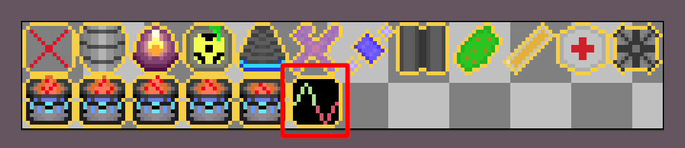

# Append Sprite to Spritesheet

Once your item is designed, and you have received feedback on your
submitted item issue, you can begin putting it in the game!

Refer to the [Contributing Guidelines](/book/src/contributing.md) section for
details on how to fork, run, and edit the game on your machine.

If you do not have art yet, or you don't want to contribute art, that's okay!
There is an item placeholder
sprite already on the spritesheet that you can use for your item. It looks like this
(but scaled down to 14 by 14 pixels on the actual spritesheet):


If you do have your own pixel art, you can add it to the items spritesheet
located at `assets/texture/items_spritesheet.png`. Add your 14 by 14 pixel
sprite for your item to the bottom row at the right end.



Save the spritesheet containing your new item, overwriting the existing items
spritesheet.

The next thing you need to do, when adding your own pixel art,
is edit `assets/texture/items_spritesheet.ron` to tell
Amethyst where the new sprite is located. The vast majority of this file is an array
called "sprites" containing coordinates and dimensions for each of the item
sprites on the spritesheet. Scroll all the way down to the end of this file and
append the coordinate and dimension data for your new sprite. Below is an
example for the "Frequency Augmentor" item.

```rust
List((
    texture_width: 168,
    texture_height: 70,
    sprites: [
        ...

        (
            x: 70,
            y: 14,
            width: 14,
            height: 14,
        ),
    ],
))

```

The width and height for all sprites on the item spritesheet should be 14,
and the x and y coordinates should both be multiples of 14.

At this point you should be able to build and run the game with no errors.
If this is the case, you can move on to the next section.
