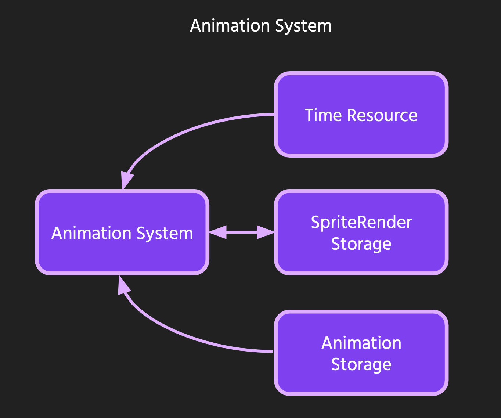

# Architecture

Theta Wave is made with the Amethyst game engine. This means that
the design methodology Theta Wave uses is ECS (Entity Component System).
This section will provide an overview of the Entities, Components, and Systems
present in Theta Wave. The aim here is to provide a resource for how
ECS is applied to this specific game. But it can also serve as an example of
what a game architecture using ECS could look like in practice.

