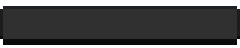
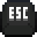

# Controls

In Theta Wave you control a spaceship character. You can move around,
shoot, use abilities, and buy items from the store.

|  Key   |                                    |      Action       |
| :----: | :--------------------------------: | :---------------: |
|   W    |          |   Accelerate up   |
|   S    |          |  Accelerate down  |
|   A    |          |  Accelerate left  |
|   D    |          | Accelerate right  |
| Space  |  |    Fire blast     |
|  Left  |    | Barrel roll left  |
| Right  |  | Barrel roll right |
|   1    |      |  Buy shop slot 1  |
|   2    |      |  Buy shop slot 2  |
|   3    |  |  Buy shop slot 3  |
| Escape |      |  Pause the game   |
