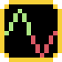

# Design your Item

Before you start modifying the source files to add your item to the game, you
should first come up with a clear idea for your item.
You should consider the following attributes for the item:

- What benefits will it provide? (e.g. increase damage, fire rate, health, etc)
- Are there any trade-offs to these benefits? (e.g. large increase in
  fire rate, but lowers damage per blast)
- What price should it be listed as in the store? (Items should be priced
  according to their net benefit.)

Once you have an idea for each of the points listed above, you should be ready
to start implementing your item. However, if you have ideas for the presentation
of the item in the game (keeping our [Code of Conduct](https://github.com/amethyst/space_shooter_rs/blob/master/CODE_OF_CONDUCT.md)
in mind) you can come up with those now too. This includes:

- What will the item be called? Try keeping your item's name consistent with
  space_shooter_rs's sci-fi/cosmic-horror theme.
- What will the item look like? The item's sprite should be a visual
  representation of the name you gave it.

When you have the required information for your item, submit an issue if there isn't
one already. Make sure to give the issue the "item" tag.

## Example Item

I want to create an item that will:

- Provide a substantial increase in fire rate.
- The increase in fire rate will come at the cost of some damage per blast.
- Cost $8 from the store.

This item will be called "Frequency Augmentor" because it sounds "sci-fi-y" and
somewhat relates to what the item does. The item will look like this:

*Note that this image is scaled up 500%. The actual sprite on the items spritesheet
is only 14x14 pixels.*
