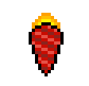

# Enemies

Enemies can damage the player and the defense. Upon being destroyed they have a
chance to drop consumables.

| Name | | Description |
| :--: | :---: | :---------: |
|      Drone       |                        |                  Most basic enemy in the game. Moves towards the bottom of the arena and does defense damage on arrival.                  |
|       Pawn       |                          |         Moves towards the bottom of the arena at a reduced speed and does defense damage on arrival. Periodically fires a blast.          |
|     Strafer      |                    | Strafes left and right towards the bottom of the arena at a reduced speed and does defense damage on arrival. Periodically fires a blast. |
|     Missile      |                    |                   Moves towards the player until it is destroyed or impacts. Does a large amount of damage on contact.                    |
| Missile Launcher |  |      Moves towards the bottom of the arena at a very reduced speed and does defense damage on arrival. Periodically fires a missile.      |
