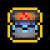
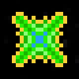

# Items

Items can be purchased from the shop (bottom right). They grant the player
permanent augmentations.

| Name | | Description |
| :-: | :-: | :-: |
|      Steel Barrel       |                        |   Gives player collision damage immunity while barrel rolling    |
|      Plasma Blasts      |                        |                  Increases fire rate and damage                  |
|    Hazardous Reactor    |              |                     Increases maximum speed                      |
|      Warp Thruster      |                      |             Increases acceleration and deceleration              |
| Tentaclover |  |                  Grants chance to critical hit                   |
|    Defense Satellite    |              |                    Increases maximum defense                     |
|      Double Barrel      |                      |                       Grants double blasts                       |
|     Yithian Plague      |                    |                     Grants chance to poison                      |
|          Spice          |                                      |               Decreases barrel roll cooldown time                |
|    Enhanced Plating     |                |               Increases maximum health by a factor               |
| Structure Reinforcement |  |                     Increases maximum health                     |
|   Blast Size Enhancer   |          |                     Increases size of blasts                     |
|   Frequency Augmentor   |          | Sharply increases fire rate of blasts at the cost of some damage |
|   Tractor Beam          |                        | Increases attraction radiuses for items and consumables |
|   Blast Repeller         |                        | Pushes nearby blasts away from the player |
